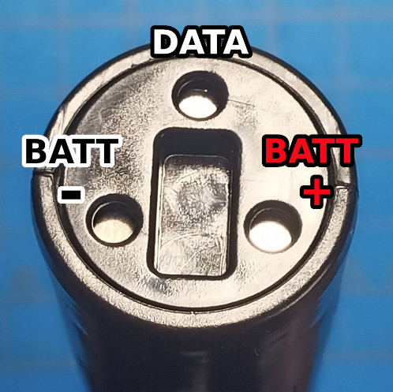
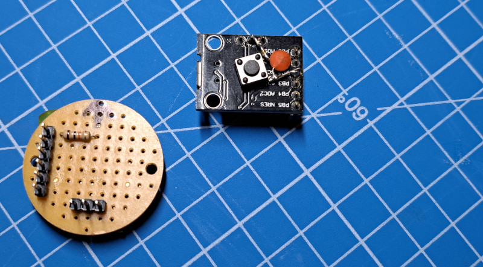
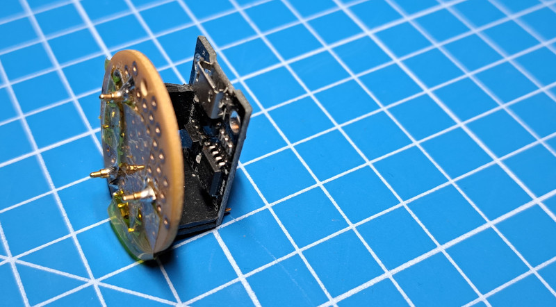

# Hilt Simulator
This project was initially developed as a means to explore all possible commands that can be sent to a Galaxy's Edge lightsaber blade in an attempt to document blade features and capabilities. It was subsequently turned into a blade tester and demonstrator.

This code was developed with a DigiSpark, however other Arduino IDE compatible boards should work with some modification to the code.

## Blade Interface
To connect to the blade an interface PCB was created with male headers on one side that plug into the female header of the Arduino compatible device (a DigiSpark). On the other side of the interface board are 3 POGO pins which can be pressed against the base of a Galaxy's Edge lightsaber blade to create a connection to the blade. Other methods of connection may be available such as taping wires to the contact pads of the blade or even soldering wires directly to the blade controller. 

**You must add a 10K (or higher) resistor between the DATA pin of the lightsaber blade and the data pin of the Arduino device.** Failure to do this may destroy the lightsaber blade's controller.

Connect the VIN pin of the Arduino device to the BATT+ of the blade connector. This is because VIN is unregulated and can supply higher currents needed to power the blade than the regulated 5V pin on most Arduino devices.

GND on the Arduino device should be connected to the BATT- of the blade.

### Blade Side Connector

### DigiSpark and Blade Interface PCB Example
The DigiSpark has a button soldered across pin 2 and GND. A small ceramic capacitor, 100nF, is also soldered between pin 2 and GND to provide some debounce.

